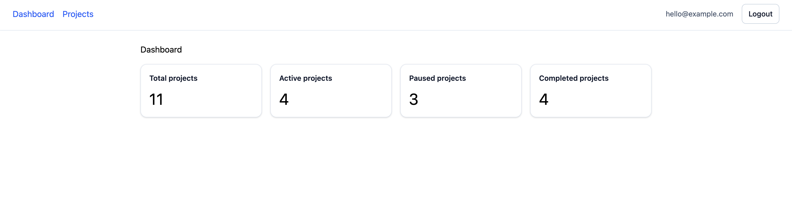
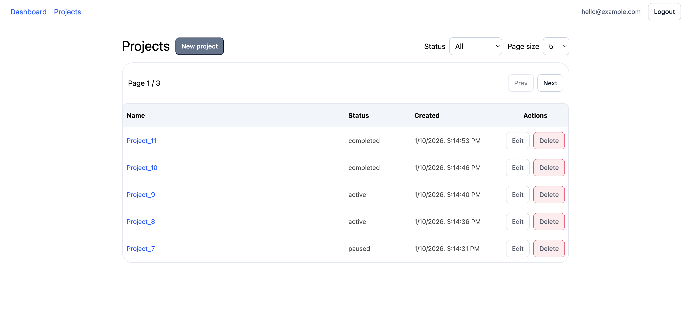
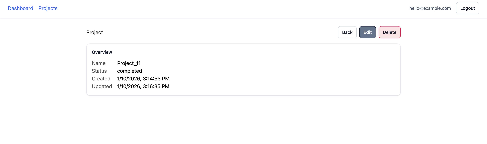

# SaaS Dashboard (Vue 3 + Node + Postgres)

A small full-stack dashboard app with authentication, protected pages, CRUD for projects, and a stats dashboard.

## Tech Stack

**Frontend**
- Vue 3 (Composition API)
- Pinia
- Vue Router
- Tailwind CSS (via Vite)
- Vite

**Backend**
- Node.js (Express)
- PostgreSQL
- JWT authentication

## Features

- Register / Login / Logout
- Protected routes with guards
- Projects: list + create + edit + delete
- Project details page
- Dashboard stats endpoint (project counts by status)
- Consistent UI components + Tailwind styling
- Basic loading + error states

## Screenshots

---


---


---


---


---

## Local Development

### Prereqs
- Node.js 22+
- Docker (for Postgres)

### 1) Start Postgres (Docker)
From repo root:

```bash
docker compose up -d
```

### 2) Backend Setup
```bash
cd backend
cp .env.example .env
npm install
npm run dev
```

### 2) Frontend Setup
```bash
cd frontend
cp .env.example .env
npm install
npm run dev
```

### API Routes Summary

Auth:
- POST /auth/register
- POST /auth/login
- GET /auth/me

Projects:
- GET /projects
- POST /projects
- GET /projects/:id
- PUT /projects/:id
- DELETE /projects/:id

Stats:
- GET /stats